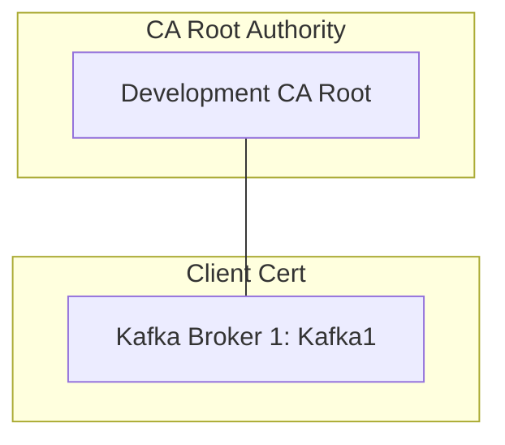
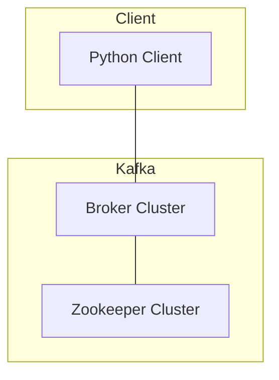
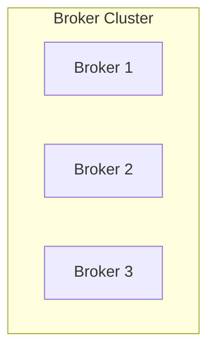
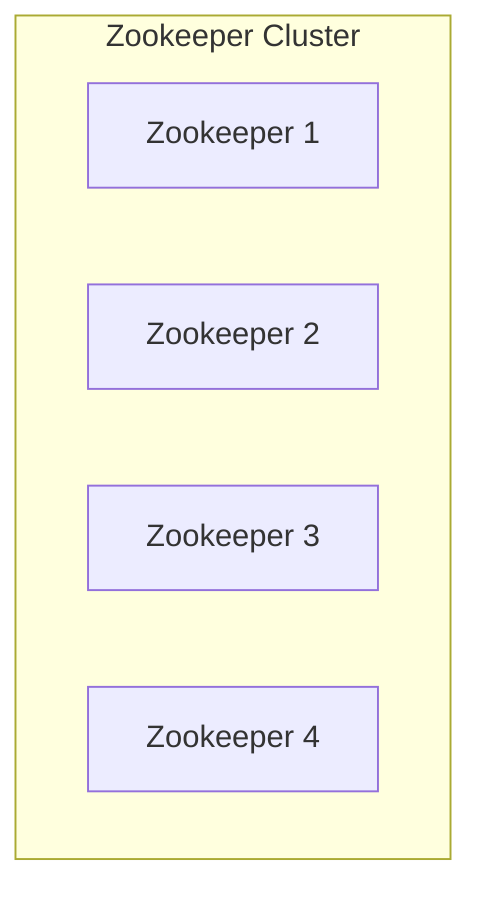

# Setup
## Pre-requites
* Install docker: [Get Docker](https://docs.docker.com/get-docker/)
* Openssl
* OpenJdk

## Steps
* Download repo, extract if necessary
* open terminal
* in the terminal change directory `cd` to folder with code in it.
* in the terminal `cd` into the cert folder
* in the terminal you will source the ssl script `source ssl.sh`.
  this will allow you to call functions in the shell script.
* in the terminal `main` which will execute the main function in `ssl.sh`
  * main function script:
    ```bash
    function main {
        make_folders
        check_key_file
        set_variables
    }
    ```
* **Create ca root authority** if and only if one is not present
  run `create_ca` function entering information as needed.
* **Creating a client cert** with `sign_cert <name>` which will sign a cert to the CA created. note `<name>` should follow openssl naming conventions.
## Java
> The crt and key files must exists before running the `trust_store` and `key_store <name>` commands

Java users can make a trust-store, a jks file with only crts in them by running the command `trust_store`.
If you need a key_store for the client certs you can run
`key_store <name>` where the `<name>` matches the one used in `sign_cert <name>`.

## After Adding to store
After certs are added to the key and trust store you may have to restart the zookeeper and broker instances. In production instances you can do a rolling release so only one instance out of `n` are down a at a time.

# Overview

## OpenSSL
OpenSSL is a library for applications to secure network communications via SSL and TLS protocols - [wiki](https://en.wikipedia.org/wiki/OpenSSL)

OpenSSL is used to create the following:


## Kafka




## Brokers
Brokers implement the [Kafka protocol](https://kafka.apache.org/protocol#:~:text=Kafka%20uses%20a%20binary%20protocol,of%20the%20following%20primitive%20types.)


## Apache ZooKeeper

Distributed Service key value store. Key services:
* [Synchronization service](https://en.wikipedia.org/wiki/Synchronization_(computer_science))
* [Naming registry](https://en.wikipedia.org/wiki/Directory_service)
* [Configuration service](https://en.wikipedia.org/wiki/Configuration_management)

[- Wiki](https://en.wikipedia.org/wiki/Apache_ZooKeeper)

> **Note:** Kafka Uses Zookeeper to store topic information such as current `group.id` offset position.


